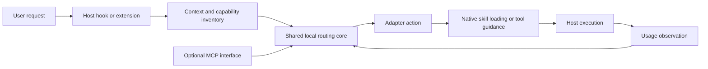

# System architecture

Status: architecture baseline with all 14 guided choices recorded. Implementation and compatibility testing are tracked in the delivery checklist.

## Structure

Kitroute consists of a shared local routing core, host-specific adapters, and an optional MCP interface. The adapter brings routing into the host lifecycle; the MCP interface exposes catalog and routing operations for interactive use and other integrations.

## Responsibilities

| Component | Owns |
| --- | --- |
| Host adapter | Hook registration, capability discovery, host context normalization, native action translation, and evidence collection. |
| Capability inventory | Eligible skills, available tool metadata, source identity, current availability, and refresh state. |
| Routing core | Candidate retrieval, eligibility filtering, ranking, abstention, concise reasons, and session routing state. |
| Observation layer | Selection and activation evidence, tool results, skipped recommendations, and separately evaluated outcomes. |
| Optional MCP interface | Calls into the shared core for routing, inspection, and explanations. |

The core does not assume that all agents expose the same events or loading APIs. Each adapter declares what it can discover, load, recommend, and observe.

Use supported agent information as the first source for capability discovery. Use skill and configuration files as a fallback where needed. File discovery alone does not establish current tool availability. Preserve unknown availability rather than treating an installed entry as callable.

## Local execution

Use TypeScript for the shared core and adapter code where the host supports it. Select and pin the execution runtime during implementation on Windows and Pop!_OS Linux.

Use a local core so automatic routing does not require a hosted service. Start Kitroute when needed for each routing request and reuse a saved local index. The initial release does not require a background service. Measure startup and indexing overhead during evaluation.

Store the local capability index and usage records in SQLite. Reuse the saved database across routing requests. Implement the database library, schema, and refresh rules through the delivery checklist.

Keep basic usage records for 30 days. Exclude user prompts and project code from usage history by default. The retention limit does not expire the reusable capability index.

Use lexical retrieval as the first measurable baseline. Add embeddings or model-based reranking only if they improve results enough to justify latency, dependencies, and cost.

## Native activation

Prefer native skill attachment where the adapter can do it. Where only context injection is supported, supply a concise selection and instructions to use the host's native loading mechanism. Report the difference to the observation layer.

MCP tool recommendations refer to existing callable tools. The host remains responsible for arguments, tool execution, and permissions. Kitroute does not proxy all MCP connections in the initial architecture.

## Automatic entry

An ordinary MCP tool does not guarantee that the model calls it before every request. Host hooks or extensions provide automatic entry. The optional MCP interface complements those adapters rather than replacing them. The protocol reasoning and sources are preserved in the [research findings](../research/02_research_findings.md).

## Recovery and scope

Bound routing work and model-visible output. If routing fails, return control to the agent and record the failure where possible. A missing capability or uncertain match produces a no-selection or unavailable result, not a guessed tool name.

Reconsider routing on each user request and clear task changes where the host exposes suitable events. Avoid repeated guidance when the selection is unchanged. Compaction and session resume require host-specific handling.

See the [lifecycle](04_routing_lifecycle.md), [contracts](05_data_contracts.md), and [decision log](06_decision_log.md).

The [implementation checklist](../delivery/11_implementation_checklist.md) tracks engineering choices, packaging, and test evidence under this architecture.

The [implementation plan](../implementation/12_implementation_plan.md) supplies the phase order and test gates. The [module map](../implementation/14_module_map_contracts.md) defines planned file boundaries and concrete interfaces.
